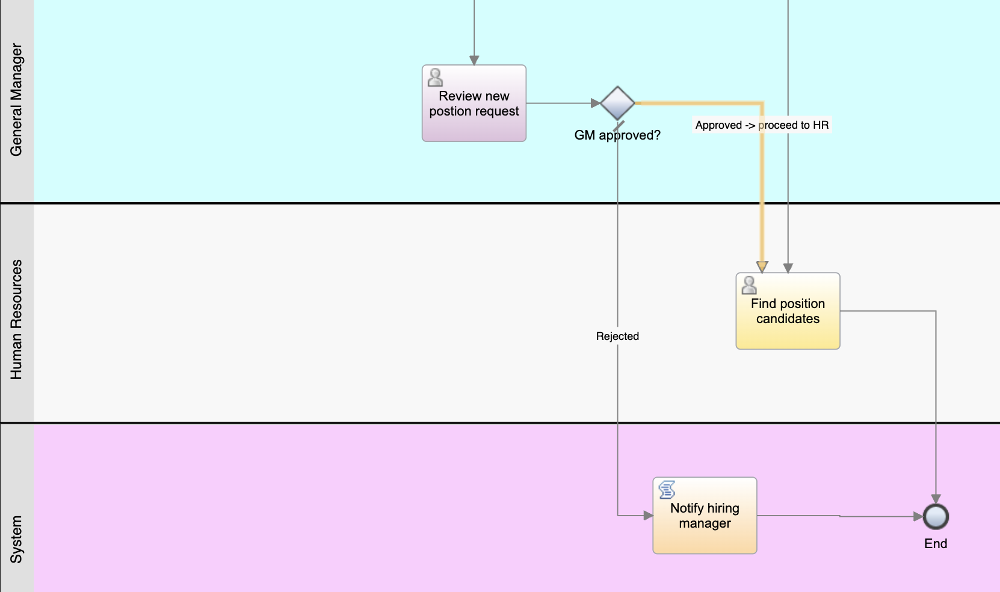

# Create the process application
A process application is a container that stores process models and supporting implementations. A process application typically 
includes processes, the services that implement activities and integrate with other systems, 
and other items required to run the processes. 

In this lesson you create the process application to contain the Standard HR Open New Position process.

1. Navigate to the provided URL on IBM Cloud.
2. Select the authentication type `Enterprise LDAP` and login with the provided user

3. Find the card `Recent Business Automations` and click `Get started` if no artifacts exist yet. Otherwise, click `View all`

4. In the `Business automations` view click `Create` and select `Workflow` -> `Workflow automation`

5. To be able to differentiate your process application from those of other lab participants, provide a unique name for your 
process application, e.g. `User1 Hiring Sample`. Add a description, e.g. `Contains the process for filling a position.`

6. Click the blue `Create` button.
7. The business automations authoring environment opens editing the process application you just created.

# Create the process
In this lesson you create a process which is a reusable diagram that defines what is common to all runtime instances of that process model.
1. Make sure your process application is open in the authoring tool.
2. In the library, click the plus sign next to `Processes` and select `Process`.

3. Provide a name for the process, e.g. `Standard HR Open New Position` and click Finish.
4. The process is created and the process diagram opens showing the following modeling constructs

The initial interface of the authoring tool includes 
  - Library (1) - provides access to the library items for the current process application.
  - Main canvas (2) – The area in which you can graphically model your process and the other artifacts that you create in the process application. 
  Each process automatically includes a start event and an end event. Two default lanes are included for team and system tasks.
  - Palette (3) – Provides elements that you can use to model your process.
  - Properties (4) – Provides the properties of any element that you select in the main canvas.
5. Open the `Overview` page and add a description.

6. In the `Exposing` section click `Select` for `Expose to start` and then select `All Users`. This means that all users in the system will be allowed to
start an instance of this process.

7. Save your changes.

# Add activities and events
In this lesson you add activities and events to the lanes in the Standard HR Open New Position process to establish the correct process flow.

When you add activities and events, follow these guidelines:

- Ensure that activities represent logical units of work that are assigned to a participant of a process.
- Create multiple concurrent workflow steps that are assigned to one responsible role into one activity or task.
- Use verb-noun statements to label activities, such as “Submit position request”.
- Apply a top-down, left-to-right flow to your process so that it is easier to read.

Be aware of the following concepts:

| Concept | Description |
| ----------- | ----------- |
| Event | Controls flow objects for a process model. An event is something that occurs during a process. |
| Start event | Triggers the initiation of the process through a manual or automatic input. There are four types of start events - none, message, ECM content, and document. In a process, a none start event is created automatically and only one instance is allowed in the model. To start a process when an external signal is received, add a message start event to the process. |
| End event | Occurs in a process when a final decision from all activities or a partial set of activities is reached. There are four types of end events: none, message, error, and terminate. You can have multiple standard end events. |
| Activity | A single work task that a participant, whether the participant is a person or a system, accomplishes from beginning to end during a process. There are many types of activities: For example, user task, system task, script, and decision task. |
| User task | An activity is implemented as a user task when a user or human starts or completes the activity. For example, the `Submit position request` activity is a user task. |
| System task | An activity is implemented as a system task when an automated system or service completes an activity. For example, the Notify hiring manager activity is a system task. |
| Script task | An activity that uses JavaScript to access and manipulate data. |
| Decision task | An activity with a decision or condition in a business rule to determine which process implementation is started. |

Model the process:
1. Go back to the Definition tab of your process.
2. The Inline User Task is created by default when a process is created. Select this task and delete it. Also delete the arrow between the Start and the End event.

3. Click the Team lane and, in the Properties tab, change the name to Hiring Manager. As Color, select green.

4. Drag and drop a User Task activity from the palette into the Hiring Manager lane. 

5. Click the activity and type Submit position request.
6. In the Properties under the Documentation tab change the color of the activity to Blue and add a description for the activity.

7. Add the remaining Lanes and activites using the information in the following table

Note: You will find the Lane element in the palette (the most top element). To add a new Lane to your process model, drag and drop this element.

8. Select the Notify hiring manager activity and then in the properties for the activity type, select Script.
9. Move the End event to the right of the Notify hiring manager activity. Your diagram matches the following image:

Note: your work is continuously saved. You can also manually save your work when finished editing.

# Model teams
In this lesson, you model the teams that participate in the Standard HR Open New Position process.
Teams that are assigned to activities and lanes determine which users can work on tasks in Process Portal. 
If a team is assigned to a lane, members of that team can work on all the tasks that are part of that lane.

Create a team for each of the identified user roles: hiring manager, general manager, and human resources manager. 
To model the teams, you add lanes and assign teams to the process. Each lane contains the activities that the associated team or system completes. 
You also define the teams by specifying the cost per hour, members, and managers.

For the Standard HR Open New Position process, you must have the following lanes and teams:
|Lane	|  Team title |
| ----------- | ----------- |
|Hiring Manager	| HiringManagers |
|General Manager |	GeneralManagers |
|Human Resources |	Human Resources |
|System	| System |

The system lane contains the activities that IBM Business Automation Workflow completes.

1. Click the Human Resources lane.
2. Create the Human Resources Managers team:
 - In the Behavior section of the team properties, for Default Lane Team click New.
 - Type Human Resources for the name and click Finish.
 - In the Members section, click the plus sign next to User Groups and then select tw_allusers.
 
 
 

 - Note: The group tw_allusers is created automatically when you install IBM Business Automation Workflow. All registered users are part of tw_allusers. User Groups now contains the tw_allusers users.
 - In the Managers section, click Select and select `Managers of All Users`. Manager's Team is now set to the `Managers of All Users` user group.
 - Click Finish Editing.

3. To return to the Standard HR Open New Position process, click Human Resources and then select the process from the list.
4. You are now back in the main canvas of the Standard HR Open New Position process.
4. Add the remaining teams using the information in the following table:
|Lane	| Team	 | Members	| Managers |
| ----------- | ----------- | -------------- | --------------- |
|Human Resources	| Human Resources	| tw_allusers	| Managers of All Users |
|General Manager	| GeneralManagers	| tw_allusers	| Managers of All Users |
|Hiring Manager	| HiringManagers	| tw_allusers	| Managers of All Users |

You defined the teams and assigned them to lanes.

# Add sequence flows
In this lesson, you use sequence flows to connect the activities and events to establish the process flow in the Standard HR Open New Position process. At this stage of the process model, you are setting the expected flow of the process from the start to the end events.

Note: If more than one sequence flow leaves the same flow object, the first one that you add is the default sequence flow. Subsequent sequence flows that originate from the same object are followed only under certain conditions. 

Typically, you add process flow controls, which are known as gateways, when there is more than one flow out of an activity. In this lesson, you sequence only the activities and events. In the next lesson, you add the gateways.

1. In the process diagram, move your mouse to the Start event. The event displays its connection points.
2. Hover over a selection point to display a sequence flow arrow. Drag the arrow to the `Submit position request` activity. When the activity displays its selection points, drag the sequence flow onto one of them.

 

3. Connect the `Submit position request` activity to the `Find position candidates` activity and then connect the `Submit position request` activity to the `Review new position` request activity.
Notice that the flow line that goes to the `Find position candidates` activity is marked as the default flow line (a plain arrow with a back slash at the beginning of the flow line). 

  - If more than one sequence flow leaves the same flow object, the first one that you add is the default sequence flow.
  - If your sequence is incorrect and you have the wrong default line, delete all the sequence flow lines from the activity and redo them.

4. Connect the Find position candidates activity to the End event.
5. Connect the Review new position request activity to the Find position candidates activity and to the Notify hiring manager activity.
6. Connect the Notify hiring manager activity to the End event.

 

You established the process flow in the Standard HR Open New Position process.

# Add event gateways

In this lesson, you create two event gateways in the `Standard HR Open New Position` process execution.

In the previous lesson, you added a sequence flow line for each potential path from an activity. Now you add gateways to determine the branching of the paths that the process can take.

An event gateway represents a branching point in a process where only one of several flows can be followed, depending on the events that occur. For the `Standard HR Open New Position` process, you need the following gateways:

New position?: If the position request is to fill an existing position, the request goes directly from the hiring manager to HR. If the request is to fill a new position, the requisition goes to the general manager (GM) for approval.
GM approved?: The GM evaluates the request for a new position and either approves or rejects it. If the GM approves the new position, the request goes to human resources, who can then search for position candidates. If the GM rejects the new position request, the hiring manager is notified about the rejection and the process ends.

1. Drag a gateway from the palette to the right of the Submit position request activity on the process diagram. In the General properties, rename it to New position?.
2. In the General properties, verify that Exclusive Gateway is the gateway type.

 

3. Connect the New position? gateway:
  - Click the sequence flow between the `Submit position request` and the `Find position candidates` activities and press the Delete key (or right-click and select Delete).
  - Delete the sequence flow between the `Submit position request` and `Review new position` request activities.
  - Connect the `Submit position request` activity to the `New position?` gateway.
  - Connect the `New position?` gateway to the top of the `Find position candidates` activity and then to the top of the `Review new position request` activity.

4. Name the sequence flow lines:
  - Click the sequence flow between the New position? gateway and the Find position candidates activity.
  - In the Properties tab, type No approval needed –> proceed to HR as the name.
  - Click the sequence flow between New position? and Review new position request.
  - In the Properties tab, type Yes – GM approval required as the name.

 

5. Drag a gateway from the palette to the right of the Review new position request activity on the process diagram. Type GM approved? in the text box that displays over the gateway.

6. Connect the GM approved? gateway:
  - Delete the sequence flow between the Review new position request and the Find position candidates activities.
  - Delete the sequence flow between the Review new position request and Notify hiring manager activities.
  - Connect the Review new position request activity to the GM approved? gateway.
  - Connect the GM approved? gateway to the Notify hiring manager activity and the Find position candidates activity.
  - Name the sequence flow lines to Rejected and Approved –> proceed to HR. Your process model matches the following image:

 

7. Save your work.
You added event gateways to the Standard HR Open New Position process.

# Create process variables

In this lesson, you create the process variables to implement the gateway logic.

The process uses private variables because these variables are used only by this process. When you implement the process, you associate these variables with business objects that you will create.

When you create variables, follow these guidelines:

  - Create variable names that begin with a lowercase letter.
  - Capitalize the first letter of a variable type.
  - If the variable name is only one word, spell that word in all lowercase letters.
  - If the variable name consists of more than one word, capitalize the first letter of each subsequent word.
  - Remember that variable names are case sensitive.

1. Click the Variables tab in the main canvas of the Standard HR Open New Position process.
2. For a private variable, click the + sign. In the Details section that opens, type currentPosition for the name.
3. In the same way, add the requisition private variable. As a placeholder for now, leave their types as String. You will update the types after you have created the appropriate business objects. Your private variables match the following image:

4. Save your work.

You added process variables to the Standard HR Open New Position process.

# Conduct playback zero

