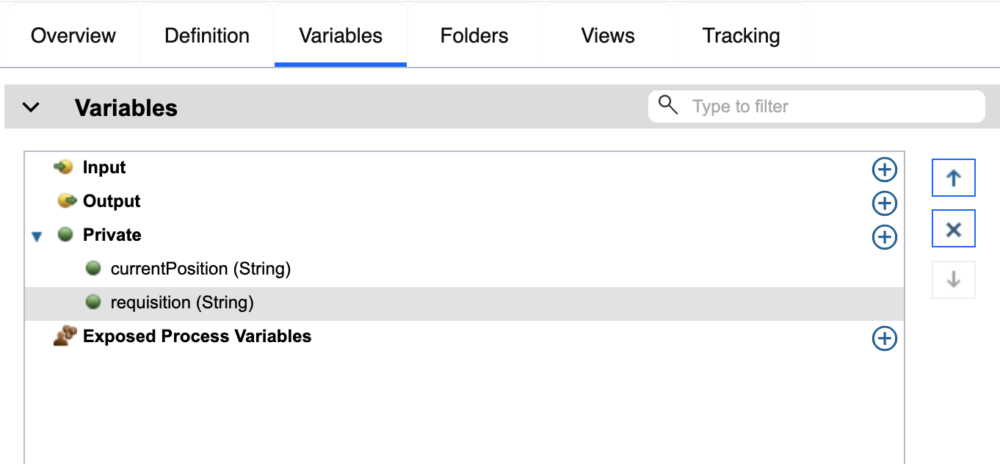

# Create business objects

In this lesson, you create the process variables to implement the gateway logic.

The process uses private variables because these variables are used only by this process. When you implement the process, you associate these variables with business objects that you will create.

When you create variables, follow these guidelines:

  - Create variable names that begin with a lowercase letter.
  - Capitalize the first letter of a variable type.
  - If the variable name is only one word, spell that word in all lowercase letters.
  - If the variable name consists of more than one word, capitalize the first letter of each subsequent word.
  - Remember that variable names are case sensitive.

1. Click the Variables tab in the main canvas of the Standard HR Open New Position process.
2. For a private variable, click the + sign. In the Details section that opens, type currentPosition for the name.
3. In the same way, add the requisition private variable. As a placeholder for now, leave their types as String. You will update the types after you have created the appropriate business objects. Your private variables match the following image:

4. Save your work.

You added process variables to the Standard HR Open New Position process.

# Implement the timer intermediate event

# Implement gateways

# Conduct Playback One